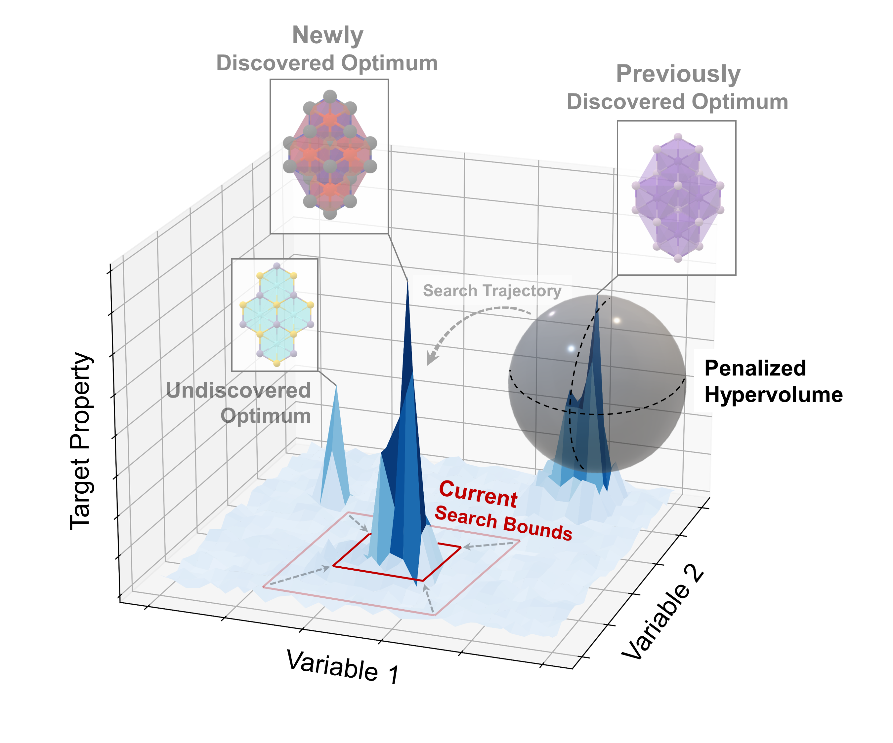

# ZoMBI-Hop
 

This repository integrates ZoMBI-Hop Bayesian optimization method with Line-BO batch selection method.

All the documentation regarding Line-BO is currently in the Line-BO repository: https://github.com/TadaSanar/Line-BO 

Start by reading the readme of the Line-BO repository - it will introduce you with the Line-BO terminology and functions. Read also the documentation of the ZoMBI-Hop repository.

## Installation

To install, clone the following repository and sub-repository:

`$ git clone https://github.com/TadaSanar/ZoMBI-Hop-LineBO.git`

`$ cd ZoMBI-Hop-LineBO`

Install conda environment (this works only if you use conda) either with free package versions:

`$ conda env create -f environment20240617.yml`

Or use the environment file with fixed versions of packages:

`$ conda env create -f environment20240617fixedversions.yml`

`$ pip install diversipy==0.9`

`$ pip install n-sphere==1.2.0`

(Optional: Install Spyder:

`$ conda install spyder`)

Run zombihop-line.py either by starting spyder and running the file, or by:

`$ python zombihop-line.py`

## Principles of integrating ZomBI-Hop and Line-BO in this repository

- Exemplary usage of the ZoMBI-Hop Line-BO is demonstrated in zombihop-line.py.
- The Line-BO functionality is implemented in linebo_fun.py and connected into ZoMBI-Hop via sampler.py. Thus, you can install new versions of ZoMBI-Hop and use them with Line-BO after you have made sure sampler.py still works with the new version of ZoMBI-Hop. Ask Armi if you need advice.
- Sampler.py can be edited freely.
- Linebo_XXX.py files are exactly the same versions than in the main Line-BO repository ( https://github.com/TadaSanar/Line-BO ). In future, these helper files will be removed from this repository and installed as links to the Line-BO repository (in other words: avoid modifying linebo_XXX.py and if you do, document the changes carefully and report them to Armi!).

## Implementing more benchmark cases

- The current implementation can be run with the following test cases (select the appropriate test case at line 109 in zombihop-line.py):
  - An analytical Ackley test function (any dimensionality beyond 3D - set dimensionality at line 107 in zombihop-line.py). The optimum of this function is shifted to point X_opt = [0.3, ..., 0.3].
  - Poisson materials test case where the pre-fitted random forest model is assumed to represent the ground truth (see the description from the ZoMBI-Hop repository). Train a random forest regression model with the Poisson data and save it with dill or pickle to file: './data/poisson_RF_trained.pkl'.
  - Food dye test case where the pre-fitted Gaussian process regression model is assumed to represent the ground truth (ask Armi for more information). Running the dye test case requires installing GPy package!
- More analytical test cases can be created by copying the approach of the Ackley test case:
  - Define the analytical test function (see line 21 of zombihop-line.py).
  - Define it for ZoMBI-Hop (see line 136 of zombihop-line.py)
- More test cases relying on pre-fitted models can be created by copying the approach of the Poisson test case:
  - See line 119 in zombihop-line.py.

## TO DO

### Acquisition implementation

ZoMBI-Hop uses an acquisition matrix by default. It is very slow with Line-BO, so I implemented acquisition function sampling as a function. This feature is many times faster than the matrix version.

Either one of the acquisition options can be run by modifying zombihop.py line 123:
- Acquisition matrix: `acq_type = None`
- Acquisition function (current implementation): `acq_type = self.acquisition_type`

### Zooming in with Line-BO

This is where I left the code in January. We need to decide whether to sample lines from the zoomed-in space ZoMBI-Hop uses or across the global search space. I recommend the choice will be done by benchmarking the performance of the Line-BO ZoMBI-HOP with zoomed-in space vs. the whole search space.

The current implementation integrates the acquisition function only over the zoomed-in space. You can change the behavior to choose the lines from the global search space by setting zombihop.py line 121 to: `emin_global = None, emax_global = None,`

The challenge with using the zoomed-in space is that the start and end points A and B, respectively, of the selected line, will be provided from the edges of the zoomed-in space. And since ZoMBI-Hop zooms in a lot, the majority of the lines will be very short and the benefit of being able to synthesize many samples at one round diminishes.

On the other hand, the challenge with the whole search space is to confirm if the samples outside the zoomed-in subspace will be stored properly while ZoMBI-Hop runs; and if they will be actually participating enough to the optimization decisions _between_ the zoom-in phases.

### Constrained BO

When optimizing material proportions, the sum of each material needs to sum up to 100%. This should be reflected in the optimization procedure, too, i.e., X should be constrained to the sum of one. This is currently not implemented in ZoMBI-Hop. Implementing the constraint(s) would increase the experiment applications for ZoMBI-Hop. See an example of how this is done in GPyOpt optimization package from linebo_wrappers.py/define_bo() line 61.

Line-BO has the constraint feature implemented via linebo_fun.py/choose_K() (set argument `constraint_sum_x = True`).

The current implementation of LineBO-ZoMBI-Hop uses another function, sampler.py/choose_K_acq_zombihop(). This function needs to be changed to linebo_fun.py/choose_K() (with argument `constraint_sum_x = True`) once ZoMBI-Hop has the constraint feature implemented. Then, one can run constrained Line-BO-ZoMBI-Hop.

### General testing

There are also some other changes compared to the original ZoMBI-Hop, mainly (or only?) in zombihop.py lines 118-131. Ask Armi for details if needed.

The code in general would benefit from testing and benchmarking since it has not been tested as well as the Line-BO with GPyOpt in the main repository ( https://github.com/TadaSanar/Line-BO ).

## Other notes

- RunTimeWarning on line 436 of linebo_fun.py is correct behavior (it occurs whenever P is at a corner of the search space): `linebo_fun.py:436: RuntimeWarning: All-NaN slice encountered; tA = np.nanmax(tAcands, axis = 1, keepdims = True)`
- Increase the number of Line-BO -related plots by setting `plotting = 'plot_all'` in line 131 of zombihop.py.
- There are more plotting functions in linebo_plots.py if needed.

